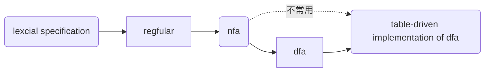
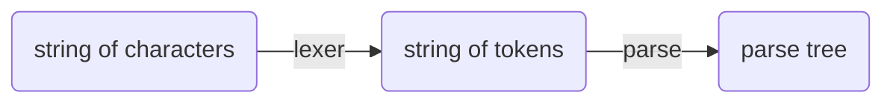

# 声明
本compile所有代码均来自[Kipery](https://github.com/Kiprey/Skr_Learning/tree/master/week3-6),在抄代码中学习，~~虽然kp也是这样~~    
值得一提的是，我并没有在standford官网上找到对应的programming assignments，而是在github、edx这些网站上找到的编程模板，这些模板留给读到本md的同学自己寻找。除此之外，standford的writing assignments在其官网上仍有handout和solutions，我认为这些习题也应完成：[cs143](http://web.stanford.edu/class/cs143/)    
当然，在官网和edx给出的programming assignments中我并没有找到kp仓库中似乎是自带的grading系统，不知道怎么来的。。。。。也许是sakura?
# 笔记
前几节课曾经写过然后删了，这是重新写的，之前的课程内容就算了。。。
## lexcial
### dfa,nfa
dfa往往更快，nfa则往往更小，确定性有穷自动机（dfa）与非确定性有穷自动机(nfa)在编译原理中的作用往往相似    

具体转换方式参考[nfa到dfa的转化、dfa的简化](https://blog.csdn.net/qq_40294512/article/details/89004777)    
要加深了解请认真完成writing assignments,期中考试和期末考试还是很值得自己做的。
### PA2
该部分主要需要完成正则表达式的编写。    
通过正则表达式，我们要完成对于names的定义，其中包括class、if、id等关键字的正则表达；      除此之外，我们还要完成对于程序语法的分析，判断其是否存在诸如：
1. 括号、引号未闭合
2. 转义字符不规范
3. 字符串过长等错误
由于之后进行的词法解析需要dfa、nfa来完成，因此我们在flex中需要确定状态的start condition,并等待状态匹配完成或者出错时结束，并确定act动作
## parsing
解析的原因是
>lots of structure in programming languages constructs and those cannot be handled by regular expressions.

>FA不能识别到达recepet状态多少次

distinguish valid from invalid

