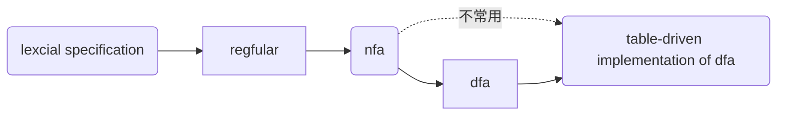
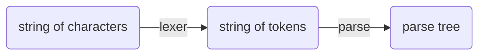
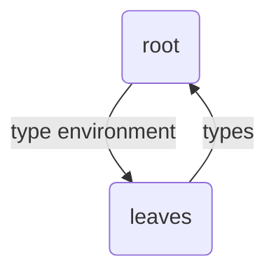

# 声明
本compile所有代码均来自[Kipery](https://github.com/Kiprey/Skr_Learning/tree/master/week3-6),在抄代码中学习，~~虽然kp也是这样~~    
值得一提的是，我并没有在standford官网上找到对应的programming assignments，而是在github、edx这些网站上找到的编程模板，这些模板留给读到本md的同学自己寻找。除此之外，standford的writing assignments在其官网上仍有handout和solutions，我认为这些习题也应完成：[cs143](http://web.stanford.edu/class/cs143/)    
当然，在官网和edx给出的programming assignments中我并没有找到kp仓库中似乎是自带的grading系统，不知道怎么来的。。。。。也许是来自sakura?       
本md仅包含一些**细枝末节**，对于一些记录比较麻烦的知识，本md并未记载，建议看视频。     
github不支持mermaid,就在我[博客](https://heeler-deer.github.io/)看吧
# 笔记
front-end:
- lexical analysis
- parsing
- semantic analysis


back-end:
- optimization
- code generation

## lexcial
### dfa,nfa
dfa往往更快，nfa则往往更小，确定性有穷自动机（dfa）与非确定性有穷自动机(nfa)在编译原理中的作用往往相似    

具体转换方式参考[nfa到dfa的转化、dfa的简化](https://blog.csdn.net/qq_40294512/article/details/89004777)    
要加深了解请认真完成writing assignments,期中考试和期末考试还是很值得自己做的。
### PA2
该部分主要需要完成正则表达式的编写。    
通过正则表达式，我们要完成对于names的定义，其中包括class、if、id等关键字的正则表达；      除此之外，我们还要完成对于程序语法的分析，判断其是否存在诸如：
1. 括号、引号未闭合
2. 转义字符不规范
3. 字符串过长等错误
由于之后进行的词法解析需要dfa、nfa来完成，因此我们在flex中需要确定状态的start condition,并等待状态匹配完成或者出错时结束，并确定act动作
## parsing
解析的原因是
>lots of structure in programming languages constructs and those cannot be handled by regular expressions.


>FA不能识别到达recepet状态多少次



果然还是要网上搜一搜才知道是什么东西。。。。     
### cfg:
CFG：context free grammar,与上下文无关的文法，可以单独拿出一个词语进行分析，解释，包括：    
>一组非终结符（VN）、一组终结符号（VT）、一组产生式（P）、一个开始符号（S）。


此处建议作课堂习题     
### a derivation
derivation可以画作一棵树，树要满足两点：
1. terminals at the leaves
2. non-terminals at the interior nodes
我们关注的是这棵parse tree的left-most and right-most，也即替换的那些字符而不是树中间的运算符号。    同时这引出了语言的模糊性：   
>if a grammar has more than one parse tree for some string,it's ambiguous.

### error

消除歧义要么重写grammar，要么确定中间符号的优先级

1. panic mode
2. error productions
### recursive descent parsing(递归下降分析)
即top-down parsing,recursive descent algorithm(RDA)可以解释任何语法
>Make sure you aren't being smarter than a recursive descent parser--it will try every production even when it is "obvious" a production will lead to a dead end.
### PA3
写一些cool-parse.cc的代码分析，
>在CV中学习 &emsp;&emsp;&emsp;&emsp;--Kipery


- yytranslate
- yydefact
- yydefgoto
- yyr1&yyr2
- yytable
- yypgoto
- yypact
- yycheck
- yyparse
##### yytranslate
用一个symbol number代表token-num
##### yydefact
存储每个状态下产生式规则的序号，当定义的rule索引为0时报错（默认rule的存在）
##### yydefgoto
传入一个nterm-num,作为一个跳转表，其值代表要跳转到的State
##### yyr1&yyr2
左右部的symbol number
##### yytable
对于当前的状态，有两种act:放入parse stack,归约（符合rule）。正数表示移入，负数表示归约。
##### yypgoto
通过yycheck判断执行默认的yydefgoto还是yypgoto，yypgoto用来处理不同的goto情况
##### yypact
定义初始状态下的部分yytable
##### yycheck
判断归约还是移入，选择跳转表
##### yyparse
parse
## week4 parsing
bottom-up parsing     
相比于recursive-descent,它对语法要求更为严格，接受LL（K）语法，which means left-to-right and working on left-most non-terminal in the parse tree.并且向前看k个tokens      
- predictive parsing需要一个stack记录解析树的frontier，
- choose the state shown at[S,a];
- stack的顶端是最左端未定(pending)的terminal或者no-terminal
- reject on reaching error state
- accept on end of input and empty stack
[这节课讲的着实不错，详细描述了一个parsing table生产一个parsing tree的过程](https://learning.edx.org/course/course-v1:StanfordOnline+SOE.YCSCS1+2T2020/block-v1:StanfordOnline+SOE.YCSCS1+2T2020+type@sequential+block@ef138cf5008e44cf81f1f6c22cb67f6d/block-v1:StanfordOnline+SOE.YCSCS1+2T2020+type@vertical+block@ecd23fda0e88420a9b49de26008295d4)
### first sets
first(x)
>all the terminals that can be derived in the first position will be in the first of X 


>x can go to epsilon  with zero or more steps,then epsilon is in the first of x


definition:
```latex
$$First(X)=\bigl\{ t|X \rightarrow t \alpha \bigr\} \cup \bigl\{\varepsilon |X\rightarrow *&\varepsilon \bigr\} $$
```
```latex
$$Follow(x)=\bigl\{t|S \rightarrow ^{*} \beta Xt \delta \bigr\}$$
```
视频中的解释已经足够理解了。
### bottom-up parsing
each step performing a **reduction**
### shift-reduce parsing

## handles  
>a handle is a reduction that allows further reductions back to the start symbol


因为先做了PA3,所以这一部分就不写了
### SLR parsing
simple LR parsing,precedence declaration可以define conflict resolutions      
要优化，就要空间换时间，change stack to conain pairs<symbol,dfa state>         
- goto[i,a]=j if state i --->a state j,也就是说，goto is the transition function of the dfa
## semantic analysis
### scope & simple tables & types
type包含static typing,dynamic  typing and none typing.
- type checking is the process of verifying fully typed programs
- type inference is the process of filling in missing type information
- a type environment gives types for free variables


### static vs. dynamic typing
static:
- detece common errors
- so some are disallowed
- self type increases the expressive power of the type system
dynamic:
- flexible
## optimization
- activation tree depends on run-time behavior and a stack can track it currently
- if f calls g,g's AR(activation records) contains complete execution of g and resume execution of f
### globals and heap
- all references to a global variable point to the same object & globals are assigned a fixed address 
- languages with dynamically allocated data use a heap to store dynamic data 
### alignment
- most machines need it,for example,"hello" may have 3 "padding" characters to word align next word
- we can optimize it
### stack machine
建议看视频
## code generation
- frame pointer(帧指针):points to the return address on the stack & it can be used to find the variables
    
- code generation must know how many temporaries are in use at each point
- layout table表示dispatch
## operational semantics
我们通过：
- an environment where in memory a variable is
- a store what is in the memory
来跟踪variables and their values.      
视频为主  
## intermediate code & optimization
the first is a language between the source and the target    
the second needs to optimize:
- execution time
- code size
- network nessahes sent
对于一个优化，通常有三个方面要做：
- local optimizations apply to a basic block in isolation
- global optimizations apply to a control-flow graph in isolation
- inter-procedural optimizations apply across method boundaties
### local optimization
- delete/simplify some statements
- compute constants at compile time ,not at run time
- remove unreachable basic blocks/code
### peephole optimization
peephole:窥视孔,replaces the sequence with another equivalent one which is faster
## dataflow analysis
### Constant Propagation
- rule1:if C(pi,x,out)=T, for any i,then C(s,x,in)=T;
- rule2:if C(pi,x,out)=c&C(pj,x,out)=d&d<>c then C(s,x,in)=T
- rule3:if C(pi,x,out)=c/bottom for all i,then C(s,x,in)=c
- rule4:if C(pi,x,out)=bottom for all i,then C(s,x,in)=bottom
- rule5:C(s,x,out)=bottom if C(s,x,in)=bottom
- rule6:C(x:=c,x,out)=c if c is a constant
- rule7:C(x:=f(...),x,out)=T
- rule8:C(y:=...,x,out)=C(y:=...,x,in) if x<>y
而对应的算法是：
1. set every entry s to C(s,x,in)=T
2. set C(s,x,in)=C(s,x,out)=bottom 
3. repeat until all points satisfy 1-8:pick s not satisfying 1-8 and update using the appropriate rule
### liveness
a variable x is live at statements s if:
- there exists a statement s' that uses x
- there is a path from s to s'
- that path has no intervening assignment to x
otherwise x is dead    
dead statements should be deleted from the program    
自己看rule    
算法：
1. let all L(...)=false initially
2. repeat until all statements s satisfy rules 1-4:pick s where one of 1-4 does not hold and update using the appropriate rule
## Register Allocation寄存器分配
many to one: t1 and t2 can share the same register if at any point in the program at most one of them live.      
建图染色判断即可(RIG)     
cache optimization没有讲多少。。。
## automatic memory management
scheme:
1. allocate space as needed for new objects
2. when space runs out:a)compute what objects might be used again b)free the space used by objects not found in a
### mark and sweep
mark标记之后就可以把标记为0的放入free list中   
这些都是很容易理解的，所以下面是PA4,PA5的分析。
## PA4
>In this assignment, you will implement a code generator for Cool. When successfully completed, you will have a fully functional Cool compiler!
引用kp的话：
>以cool语言为例，在生成目标代码前，需要先读入AST树的相关信息，重建继承图，并自上而下的初始化相关的映射表格在该初始化过程中，每个类会遍历其中的feature，并将其相关信息添加至对应的SymbolTable中如果该feature是method，则还会额外自顶向下计算所需要的最小临时变量数量，并将其添加进表格中。


下面分析semant.cc/semant.h/cool-tree.handcode.h
### cool-tree.handcode.h
继承来自PA2/3的AST,包含cool的AST的所有extensions,这些扩展主要包含以下内容：    
- program
- class
- feature
- formal
- expression
- case
- list_node
- symtables
- inheritancenode
- environment
- calctemp
- cgennode/environment/classlevel
### semant.h
这个文件主要是声明、定义在semant.cc中要用到的cross-reference,包含三个class:environment(一个描述着method/属性/all classes/self_type的symbol table)，inheritancenode(类比于数据结构中图节点的属性)，classtable(完成type checker的构建)
### semant.cc
这个文件完成cool的semantic check（千行代码有点长。。。）首先定义、声明了一些必要的symbol。之后完成environment function:
1. a mapping from method names to method definitions for X
2. a mapping from variable (local and attribute) names to definitions in X
3. a mapping from method names and class names to defintions
4. the self class (X)
如add/lookup/probe的实现：
```c
void Environment::method_add(Symbol s, method_class *m) 
{ method_table.addid(s,m); }

method_class *Environment::method_lookup(Symbol s) 
{ return method_table.lookup(s); }

method_class *Environment::method_probe(Symbol s) 
{ return method_table.probe(s); }

```
接下来是classtable（initializes a symbol table mapping
// class names to inheritance graph nodes）,最后是features，在这里实现对environment的信息进行添加（代码量极大）
## PA5
我们需要在这里实现对编译器的优化。这里我们分析cgen.h/cgen.cc,先来看看他们的组成 
### cgen.h
包含cgenclasstable，把class映射到tag，同时包含把code与constants/global declarations对应起来的method，如：
```c
   void code_global_data();
   void code_global_text();
   void code_bools();
   void code_select_gc();
   void code_constants();
   void code_strings();          /*##*/ // 无用，无函数定义
   void code_ints();             /*##*/ // 无用，无函数定义
   void code_class_table();      /*##*/
   void code_object_table();     /*##*/
   void code_class_features();   /*##*/
```
在cgenclasstable中，还create an inheritance graph from a list of classes.之后就是一些叫做binding的class,包含对self/属性/local variables的binding
### cgen.cc
主要做了定义method/emit procedure以及视频课程中从register开始后的工作，优化也体现在这一部分
