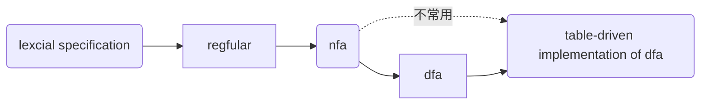
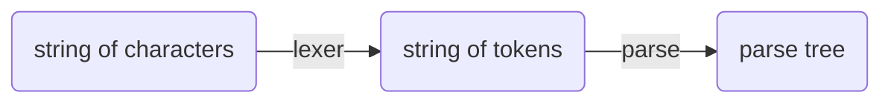

# 声明
本compile所有代码均来自[Kipery](https://github.com/Kiprey/Skr_Learning/tree/master/week3-6),在抄代码中学习，~~虽然kp也是这样~~    
值得一提的是，我并没有在standford官网上找到对应的programming assignments，而是在github、edx这些网站上找到的编程模板，这些模板留给读到本md的同学自己寻找。除此之外，standford的writing assignments在其官网上仍有handout和solutions，我认为这些习题也应完成：[cs143](http://web.stanford.edu/class/cs143/)    
当然，在官网和edx给出的programming assignments中我并没有找到kp仓库中似乎是自带的grading系统，不知道怎么来的。。。。。也许是来自sakura?       
github不支持mermaid,就在我[博客](https://heeler-deer.github.io/)看吧
# 笔记
前几节课曾经写过然后删了，这是重新写的，之前的课程内容就算了。。。
## lexcial
### dfa,nfa
dfa往往更快，nfa则往往更小，确定性有穷自动机（dfa）与非确定性有穷自动机(nfa)在编译原理中的作用往往相似    

具体转换方式参考[nfa到dfa的转化、dfa的简化](https://blog.csdn.net/qq_40294512/article/details/89004777)    
要加深了解请认真完成writing assignments,期中考试和期末考试还是很值得自己做的。
### PA2
该部分主要需要完成正则表达式的编写。    
通过正则表达式，我们要完成对于names的定义，其中包括class、if、id等关键字的正则表达；      除此之外，我们还要完成对于程序语法的分析，判断其是否存在诸如：
1. 括号、引号未闭合
2. 转义字符不规范
3. 字符串过长等错误
由于之后进行的词法解析需要dfa、nfa来完成，因此我们在flex中需要确定状态的start condition,并等待状态匹配完成或者出错时结束，并确定act动作
## parsing
解析的原因是
>lots of structure in programming languages constructs and those cannot be handled by regular expressions.


>FA不能识别到达recepet状态多少次



果然还是要网上搜一搜才知道是什么东西。。。。     
### cfg:
CFG：context free grammar,与上下文无关的文法，可以单独拿出一个词语进行分析，解释，包括：    
>一组非终结符（VN）、一组终结符号（VT）、一组产生式（P）、一个开始符号（S）。


此处建议作课堂习题     
### a derivation
derivation可以画作一棵树，树要满足两点：
1. terminals at the leaves
2. non-terminals at the interior nodes
我们关注的是这棵parse tree的left-most and right-most，也即替换的那些字符而不是树中间的运算符号。    同时这引出了语言的模糊性：   
>if a grammar has more than one parse tree for some string,it's ambiguous.

### error

消除歧义要么重写grammar，要么确定中间符号的优先级

1. panic mode
2. error productions
### recursive descent parsing(递归下降分析)
即top-down parsing,recursive descent algorithm(RDA)可以解释任何语法
>Make sure you aren't being smarter than a recursive descent parser--it will try every production even when it is "obvious" a production will lead to a dead end.

left recursion

save and next
### PA3
写一些cool-parse.cc的代码分析，
>在CV中学习


- yytranslate
- yydefact
- yydefgoto
- yyr1&yyr2
- yytable
- yypgoto
- yypact
- yycheck
- yyparse
##### yytranslate
用一个symbol number代表token-num
##### yydefact
存储每个状态下产生式规则的序号，当定义的rule索引为0时报错（默认rule的存在）
##### yydefgoto
传入一个nterm-num,作为一个跳转表，其值代表要跳转到的State
##### yyr1&yyr2
左右部的symbol number
##### yytable
对于当前的状态，有两种act:放入parse stack,归约（符合rule）。正数表示移入，负数表示归约。
##### yypgoto
通过yycheck判断执行默认的yydefgoto还是yypgoto，yypgoto用来处理不同的goto情况
##### yypact
定义初始状态下的部分yytable
##### yycheck
判断归约还是移入，选择跳转表
##### yyparse
parse
## week4 parsing
bottom-up parsing     
相比于recursive-descent,它对语法要求更为严格，接受LL（K）语法，which means left-to-right and working on left-most non-terminal in the parse tree.并且向前看k个tokens      
- predictive parsing需要一个stack记录解析树的frontier，
- choose the state shown at[S,a];
- stack的顶端是最左端未定(pending)的terminal或者no-terminal
- reject on reaching error state
- accept on end of input and empty stack
[这节课讲的着实不错，详细描述了一个parsing table生产一个parsing tree的过程](https://learning.edx.org/course/course-v1:StanfordOnline+SOE.YCSCS1+2T2020/block-v1:StanfordOnline+SOE.YCSCS1+2T2020+type@sequential+block@ef138cf5008e44cf81f1f6c22cb67f6d/block-v1:StanfordOnline+SOE.YCSCS1+2T2020+type@vertical+block@ecd23fda0e88420a9b49de26008295d4)
### first sets
first(x)
>all the terminals that can be derived in the first position will be in the first of X 


>x can go to epsilon  with zero or more steps,then epsilon is in the first of x


definition:
```latex
$$First(X)=\bigl\{ t|X \rightarrow t \alpha \bigr\} \cup \bigl\{\varepsilon |X\rightarrow *&\varepsilon \bigr\} $$
```
```latex
$$Follow(x)=\bigl\{t|S \rightarrow ^{*} \beta Xt \delta \bigr\}$$
```
视频中的解释已经足够理解了。
### bottom-up parsing
each step performing a **reduction**
### shift-reduce parsing


